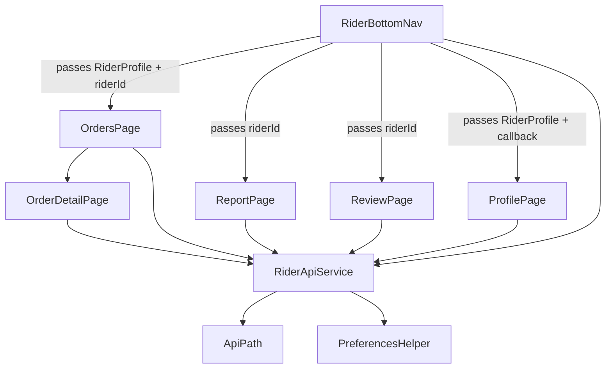

# Design Document: Rider Full Features

## Overview

This design covers porting the complete rider functionality from the sendme customer app to the sendme_rider standalone app. The work involves:

1. Lifting shared rider state from OrdersPage to RiderBottomNav so all tabs share the riderId/RiderProfile
2. Implementing the Report page with date range picker, payment mode filter, summary totals, and paginated order table
3. Implementing the Review page with average rating display and paginated review list with base64 comment decoding
4. Implementing the Profile page with rider info display, availability toggle, and logout
5. Enhancing OrderDetailPage with `isRiderGoing`-based status flow logic
6. Adding the Review model, new API methods, and the `getReports` endpoint

All code follows the existing patterns: `RiderApiService` with `_get()`/`_post()`, safe JSON parsing, `AppColors.mainAppColor` theming, `AssetsFont` font families, and modern Dart 3 conventions.

## Architecture



The RiderBottomNav becomes the single source of truth for rider data. It fetches the RiderProfile on init and passes it down to all child pages. Each page manages its own page-specific state (orders list, report data, reviews list) but shares the rider identity.

## Components and Interfaces

### 1. RiderBottomNav (Modified)

Currently receives `riderName`. Will be enhanced to:

- Fetch `RiderProfile` via `RiderApiService.fetchRiderProfile()` on init
- Hold `RiderProfile?` state with loading/error states
- Pass `riderId` and `RiderProfile` to all child pages
- Accept a callback from ProfilePage to update rider state (e.g., availability toggle)

```dart
class RiderBottomNav extends StatefulWidget {
  final String riderName;
  const RiderBottomNav({super.key, required this.riderName});
}

class _RiderBottomNavState extends State<RiderBottomNav> {
  RiderProfile? _rider;
  bool _isLoading = true;
  String? _error;
  int _currentIndex = 0;

  Future<void> _loadRider() async { ... }
  void _onRiderUpdated(RiderProfile updated) => setState(() => _rider = updated);
}
```

### 2. ReportPage (New Implementation)

```dart
class ReportPage extends StatefulWidget {
  final int riderId;
  const ReportPage({super.key, required this.riderId});
}
```

State: selectedStartDate, selectedEndDate, selectedPaymentMode, summaryList, reportList, pageIndex, totalPages, isLoadingSummary, isLoadingList, isLoadingMore, scrollController.

### 3. ReviewPage (New Implementation)

```dart
class ReviewPage extends StatefulWidget {
  final int riderId;
  const ReviewPage({super.key, required this.riderId});
}
```

State: reviewList, averageRating, paginationCursor, isLoading, isLoadingMore, scrollController.

### 4. ProfilePage (New Implementation)

```dart
class ProfilePage extends StatefulWidget {
  final RiderProfile rider;
  final ValueChanged<RiderProfile> onRiderUpdated;
  const ProfilePage({super.key, required this.rider, required this.onRiderUpdated});
}
```

### 5. OrderDetailPage (Enhanced)

Add `isRiderGoing` awareness. The updated `getNextRiderStatus` and `getNextStatusLabel` functions accept `isRiderGoing` parameter. Display messages for delivered/cancelled orders. Hide button for pending/cancelled orders.

### 6. RiderApiService (New Methods)

```dart
// GET - report summary totals
Future<List<Map<String, dynamic>>> getRiderReportSummary({
  required int riderId,
  required String fromDate,
  required String toDate,
  required int paymentMode,
}) async { ... }

// GET - paginated report list
Future<({List<Map<String, dynamic>> entries, int totalPages})> getRiderReport({
  required int riderId,
  required String fromDate,
  required String toDate,
  required int paymentMode,
  int pageIndex = 0,
}) async { ... }

// POST - paginated reviews
Future<({List<Review> reviews, Map<String, dynamic>? pagination, double averageRating})> getRiderReviews({
  required int riderId,
  Map<String, dynamic>? pagination,
}) async { ... }
```

### 7. Review Model (New)

```dart
class Review {
  final int id;
  final int userId;
  final int hotelId;
  final double rating;
  final String userName;
  final String comment;
  final String reply;
  final String dateTime;

  const Review({ ... });
  factory Review.fromJson(Map<String, dynamic> json) { ... }
}
```

### 8. RiderOrder Model (Enhanced)

Add `isRiderGoing` field:

```dart
final int isRiderGoing; // 0 = not going yet, 1 = already going
```

### 9. order_helpers.dart (Enhanced)

```dart
int? getNextRiderStatus(int currentStatus, {int isRiderGoing = 0}) { ... }
String? getNextStatusLabel(int currentStatus, {int isRiderGoing = 0}) { ... }
```

## Data Models

### Review Model

| Field    | Type   | JSON Key | Default |
| -------- | ------ | -------- | ------- |
| id       | int    | Id       | 0       |
| userId   | int    | userId   | 0       |
| hotelId  | int    | hotelId  | 0       |
| rating   | double | rating   | 0.0     |
| userName | String | userName | ''      |
| comment  | String | comment  | ''      |
| reply    | String | reply    | ''      |
| dateTime | String | dateTime | ''      |

### RiderOrder Model Addition

| Field        | Type | JSON Key     | Default |
| ------------ | ---- | ------------ | ------- |
| isRiderGoing | int  | isRiderGoing | 0       |

### Report Summary (raw Map from API)

| Key                  | Type               |
| -------------------- | ------------------ |
| Currency             | String             |
| TotalBillAmount      | dynamic            |
| DeliveryChargeAmount | dynamic            |
| GSTOnDeliveryCharge  | dynamic            |
| GSTOnBillAmount      | dynamic (nullable) |

### Report Entry (raw Map from API)

| Key                        | Type    |
| -------------------------- | ------- |
| orderId                    | int     |
| orderOn                    | String  |
| deliveryCharge             | dynamic |
| totalBill                  | dynamic |
| commissionOnDeliveryCharge | dynamic |
| currency                   | String  |

## Correctness Properties

_A property is a characteristic or behavior that should hold true across all valid executions of a system — essentially, a formal statement about what the system should do. Properties serve as the bridge between human-readable specifications and machine-verifiable correctness guarantees._

### Property 1: Review comment base64 round-trip

_For any_ valid UTF-8 string, encoding it to base64 and then decoding using the Rider_App's comment decoding logic should produce the original string.

**Validates: Requirements 4.4**

### Property 2: Review model JSON round-trip with safe parsing

_For any_ valid Review object, converting it to JSON via `toJson()` and parsing it back via `Review.fromJson()` should produce an equivalent Review object. Additionally, _for any_ JSON map with arbitrary value types (null, int, String, double, missing keys), `Review.fromJson()` should not throw and should produce a Review with valid default values.

**Validates: Requirements 5.1, 5.4**

### Property 3: RiderOrder model JSON round-trip preserves isRiderGoing

_For any_ valid RiderOrder object (including the new `isRiderGoing` field), converting it to JSON via `toJson()` and parsing it back via `RiderOrder.fromJson()` should produce an equivalent RiderOrder with the same `isRiderGoing` value.

**Validates: Requirements 7.1**

### Property 4: Status flow correctness

_For any_ combination of `(orderStatus, isRiderGoing)` values, `getNextRiderStatus(orderStatus, isRiderGoing: isRiderGoing)` and `getNextStatusLabel(orderStatus, isRiderGoing: isRiderGoing)` should return values consistent with the defined status flow:

- If isRiderGoing == 0 and status is accepted/going/prepared: next status is RIDER_GOING (9), label is "I Am Going"
- If isRiderGoing == 1 and status is accepted/going/prepared: next status is ORDER_PICKED (7), label is "Picked"
- If status is ORDER_PICKED: next status is ORDER_DELIVERED (8), label is "Delivered"
- If status is ORDER_DELIVERED, cancelled, or pending: next status is null, label is null

**Validates: Requirements 7.2, 7.3, 7.4, 7.5, 7.6, 7.7, 7.9, 7.10**

## Error Handling

| Scenario                             | Handling                                                              |
| ------------------------------------ | --------------------------------------------------------------------- |
| RiderProfile fetch fails on nav init | Show error message with retry button; do not render child pages       |
| Report summary API fails             | Show error snackbar; keep existing summary data if any                |
| Report list API fails                | Show error snackbar; keep existing list data if any                   |
| Reviews API fails                    | Show error snackbar; set review list to empty                         |
| Availability toggle API fails        | Revert toggle to previous state; show error snackbar                  |
| Logout preferences clear fails       | Still navigate to login (best effort)                                 |
| Status update API fails              | Show error snackbar; keep current order state unchanged               |
| Base64 comment decode fails          | Display empty string for the comment                                  |
| Network unavailable                  | ApiException with "No internet connection" message (existing pattern) |
| Request timeout                      | ApiException with "Request timed out" message (existing pattern)      |

## Testing Strategy

### Unit Tests

- Review model `fromJson` with valid data, null fields, type mismatches
- RiderOrder model `fromJson` with `isRiderGoing` field present and absent
- `getNextRiderStatus` and `getNextStatusLabel` with all status/isRiderGoing combinations
- Base64 comment decoding with valid, empty, and malformed input
- Default date calculation for report page (1st of month, today)

### Property-Based Tests

- Use the `dart_check` or `glados` package for property-based testing in Dart
- Minimum 100 iterations per property test
- Each test tagged with: **Feature: rider-full-features, Property {number}: {title}**

Property tests:

1. **Feature: rider-full-features, Property 1: Review comment base64 round-trip** — Generate random UTF-8 strings, encode to base64, decode, verify equality
2. **Feature: rider-full-features, Property 2: Review model JSON round-trip** — Generate random Review objects, toJson → fromJson, verify equality; also generate random Maps, verify fromJson doesn't throw
3. **Feature: rider-full-features, Property 3: RiderOrder isRiderGoing round-trip** — Generate random RiderOrder objects with isRiderGoing, toJson → fromJson, verify isRiderGoing preserved
4. **Feature: rider-full-features, Property 4: Status flow correctness** — Generate random (orderStatus, isRiderGoing) pairs, verify getNextRiderStatus and getNextStatusLabel return expected values per the flow rules
