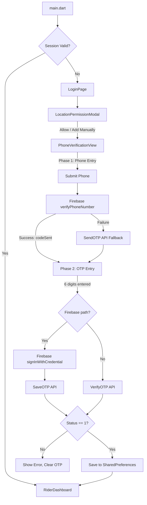

# Design Document: Rider Login

## Overview

The Rider Login feature implements phone number + OTP authentication for the `sendme_rider` Flutter app. The architecture mirrors the `sendme` customer app's `PhoneVerificationView` pattern but is simplified: the app opens the login page directly (no LocationView), shows a location permission modal on the login page, and navigates to a placeholder Rider Dashboard after authentication.

The flow is: App Launch → Session Check → Login Page (with location modal) → Phone Entry → OTP Entry → API Save/Verify → Dashboard.

## Architecture



## Components and Interfaces

### 1. `main.dart` (Modified)

Initializes Firebase, checks session via `PreferencesHelper`, and routes to either `LoginPage` or `RiderDashboard`.

```dart
Future<void> main() async {
  WidgetsFlutterBinding.ensureInitialized();
  await Firebase.initializeApp();
  // Get device info, Firebase token
  runApp(const SendmeRiderApp());
}
```

The `MaterialApp.home` will use a `SplashRouter` widget that reads SharedPreferences and navigates accordingly.

### 2. `LoginPage` (`lib/src/authorization/login_page.dart`)

- StatefulWidget
- On `initState`, shows `LocationPermissionModal` via `WidgetsBinding.instance.addPostFrameCallback`
- Body contains `PhoneVerificationView`
- Uses `PopScope` (not deprecated `WillPopScope`)

Interface:

```dart
class LoginPage extends StatefulWidget {
  const LoginPage({super.key});
}
```

### 3. `LocationPermissionModal`

A dialog shown via `showDialog()` from within `LoginPage.initState` (post-frame callback).

```dart
Future<void> showLocationPermissionModal(BuildContext context) async {
  // showDialog with "Allow" and "Add Manually" buttons
  // "Allow" → Geolocator.requestPermission() or permission_handler
  // "Add Manually" → Navigator.pop(context)
}
```

This is a function, not a separate widget file — it lives inside `login_page.dart`.

### 4. `PhoneVerificationView` (`lib/src/authorization/phone_verification_view.dart`)

- StatefulWidget with two phases controlled by a `bool sendOTPPressed`
- Phase 1: Phone number input (`IntlPhoneField`), T&C checkbox, "Next" button
- Phase 2: OTP input (`PinCodeTextField`), "Change" link, "Resend" link, "Next" button

Interface:

```dart
class PhoneVerificationView extends StatefulWidget {
  final VoidCallback? onLoginSuccess;
  const PhoneVerificationView({super.key, this.onLoginSuccess});
}
```

Key methods:

- `verifyPhone()` — calls `FirebaseAuth.instance.verifyPhoneNumber()`
- `saveUserToDBAndNavigate()` — calls SaveOTP or VerifyOTP API, parses response, saves to prefs
- `signIn()` — calls `FirebaseAuth.instance.signInWithCredential()`
- `resendOTP()` — calls SendOTP API
- `continueButtonOnClick()` — validates input, initiates OTP flow
- `changeNumberOnClick()` — resets to phone entry phase

### 5. `UserModel` (`lib/src/models/user_model.dart`)

```dart
class UserModel {
  final int? userId;
  final String? name;
  final String? mobile;
  final String? email;
  final int? userType;
  final int? cityId;
  final double? latitude;
  final double? longitude;

  UserModel({...});
  factory UserModel.fromJson(Map<String, dynamic> json);
  Map<String, dynamic> toJson();
}
```

### 6. `PreferencesHelper` (`lib/src/resources/preferences_helper.dart`)

```dart
class PreferencesHelper {
  static const String prefRiderData = 'RiderData';

  static Future<String?> readStringPref(String key) async;
  static Future<bool> saveStringPref(String key, String value) async;
  static Future<bool> isLoggedIn() async;
  static Future<UserModel?> getSavedRider() async;
  static Future<void> clearSession() async;
}
```

### 7. `RiderDashboard` (`lib/src/ui/rider_dashboard.dart`)

Simple placeholder screen:

```dart
class RiderDashboard extends StatelessWidget {
  final String riderName;
  const RiderDashboard({super.key, required this.riderName});
}
```

### 8. Barrel File Updates (`flutter_project_imports.dart`)

Add exports:

```dart
export 'package:sendme_rider/src/authorization/login_page.dart';
export 'package:sendme_rider/src/authorization/phone_verification_view.dart';
export 'package:sendme_rider/src/models/user_model.dart';
export 'package:sendme_rider/src/resources/preferences_helper.dart';
export 'package:sendme_rider/src/ui/rider_dashboard.dart';
```

## Data Models

### UserModel

| Field     | Type    | JSON Key            | Description           |
| --------- | ------- | ------------------- | --------------------- |
| userId    | int?    | UserId              | Rider's unique ID     |
| name      | String? | Name                | Rider's display name  |
| mobile    | String? | userMobile / Mobile | Phone number          |
| email     | String? | email               | Email address         |
| userType  | int?    | userType            | User type (2 = rider) |
| cityId    | int?    | cityId              | Assigned city         |
| latitude  | double? | Latitude            | Last known latitude   |
| longitude | double? | Longitude           | Last known longitude  |

### API Response Format

All OTP endpoints return:

```json
{
  "Status": 1,
  "Message": "Success",
  "Data": {
    "UserId": 123,
    "Name": "Rider Name",
    "userMobile": "9876543210",
    "email": "rider@example.com",
    "userType": 2,
    "cityId": 1,
    "Latitude": 28.6139,
    "Longitude": 77.209
  }
}
```

### API Endpoints (from existing `ApiPath`)

| Endpoint  | Method | Key Parameters                                                          |
| --------- | ------ | ----------------------------------------------------------------------- |
| SaveOTP   | GET    | countryCode, mobileNumber, deviceToken, deviceId, packageName, password |
| SendOTP   | GET    | mobileNumber, countryCode, packageName, password                        |
| VerifyOTP | GET    | mobileNumber, accessToken (OTP), deviceToken, packageName, password     |

## Correctness Properties

_A property is a characteristic or behavior that should hold true across all valid executions of a system — essentially, a formal statement about what the system should do. Properties serve as the bridge between human-readable specifications and machine-verifiable correctness guarantees._

Property 1: Session routing correctness
_For any_ SharedPreferences state, if the "RiderData" key contains non-empty valid JSON with a non-null Data field, the router shall return RiderDashboard; otherwise it shall return LoginPage.
**Validates: Requirements 1.1, 1.2, 6.2, 6.3**

Property 2: Session persistence round-trip
_For any_ valid API response body string, saving it via `PreferencesHelper.saveStringPref("RiderData", body)` then reading via `PreferencesHelper.readStringPref("RiderData")` shall return the same string.
**Validates: Requirements 6.1, 6.3**

Property 3: AppConfig URL resolution
_For any_ AppConfig instance, the Terms & Conditions URL and Privacy Policy URL resolved by the Phone_Verification_View shall equal `appConfig.termsAndConditionsLink` and `appConfig.privacyPolicyLink` respectively.
**Validates: Requirements 3.3, 3.4**

Property 4: Next button disabled state
_For any_ combination of phone number length and checkbox state, the "Next" button shall be visually disabled (reduced opacity) if and only if the phone number length is outside the valid range for the selected country OR the checkbox is unchecked.
**Validates: Requirements 3.6**

Property 5: OTP auto-submit on complete input
_For any_ 6-character digit string entered into the PIN code field, the Phone_Verification_View shall automatically trigger OTP verification submission.
**Validates: Requirements 4.3**

Property 6: Change number resets to phone entry
_For any_ OTP phase state, invoking the "Change" action shall reset `sendOTPPressed` to false, clear the OTP text controller, and return to the phone entry phase.
**Validates: Requirements 4.4**

Property 7: OTP API URL construction
_For any_ valid phone number, country code, device token, device ID, package name, and password, the constructed SaveOTP, SendOTP, and VerifyOTP URLs shall contain all required query parameters with correctly encoded values.
**Validates: Requirements 4.6, 5.2, 5.4**

Property 8: API response status handling
_For any_ API response JSON, if Status equals 1 and Data is non-null, the handler shall parse a UserModel and save the response; if Status equals 0, the handler shall extract and display the Message field and clear the OTP input.
**Validates: Requirements 5.5, 5.6**

Property 9: UserModel serialization round-trip
_For any_ valid UserModel instance, calling `UserModel.fromJson(model.toJson())` shall produce a UserModel with equivalent field values.
**Validates: Requirements 7.1, 7.2, 7.3, 7.4**

Property 10: Dashboard displays rider name
_For any_ UserModel with a non-null name, the RiderDashboard shall render a widget containing that name string.
**Validates: Requirements 8.2**

## Error Handling

| Scenario                               | Handling                                                         |
| -------------------------------------- | ---------------------------------------------------------------- |
| Firebase `verifyPhoneNumber` fails     | Fall back to `SendOTP` API endpoint, transition to OTP phase     |
| `signInWithCredential` throws          | Set error state, display SMS verification error, clear OTP field |
| SaveOTP/VerifyOTP API returns Status 0 | Display `data["Message"]` as toast, clear OTP field              |
| SaveOTP/VerifyOTP API times out (10s)  | Display timeout error toast, allow retry                         |
| Network connection failure             | Display generic error toast                                      |
| JSON parse exception on API response   | Display generic error toast, clear OTP field, allow retry        |
| Empty/null phone number submission     | Display validation error, prevent OTP initiation                 |
| Unchecked T&C checkbox                 | Display acceptance required message, prevent OTP initiation      |
| SharedPreferences read failure         | Treat as no session, show LoginPage                              |

## Testing Strategy

### Property-Based Testing

Use the `dart_check` or `glados` package for property-based testing in Dart/Flutter. Each property test should run a minimum of 100 iterations.

Each property-based test must be tagged with a comment:

```dart
// Feature: rider-login, Property N: <property_text>
```

Property tests to implement:

- **Property 9** (UserModel round-trip) — highest value, catches serialization bugs
- **Property 2** (Session persistence round-trip) — validates SharedPreferences read/write
- **Property 7** (OTP API URL construction) — validates URL building with various inputs
- **Property 1** (Session routing) — validates routing logic
- **Property 8** (API response status handling) — validates response parsing branches

### Unit Testing

Unit tests complement property tests for specific examples and edge cases:

- Session check with empty string, null, malformed JSON
- UserModel.fromJson with missing fields (null safety)
- API URL construction with special characters in phone numbers
- Button state with boundary phone number lengths
- OTP field auto-submit with exactly 6 digits
- Change number action resets all state correctly
- Error toast displayed on timeout/network failure

### Widget Testing

Widget tests for UI-specific requirements:

- LoginPage shows location permission modal on init
- PhoneVerificationView renders phone input in phase 1
- PhoneVerificationView renders OTP input in phase 2
- "Next" button opacity changes based on validation state
- T&C and Privacy Policy links are tappable
