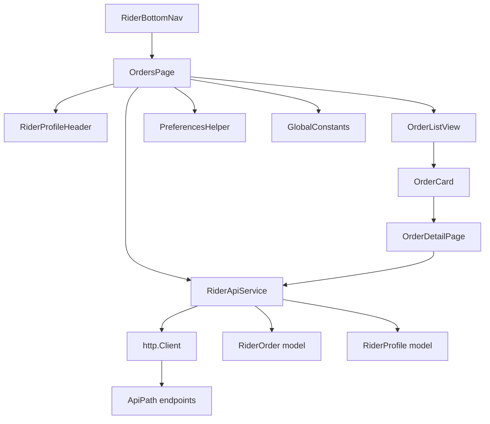

# Design Document: Rider Orders

## Overview

This design replaces the placeholder Orders page in sendme_rider with a full order management system. The architecture follows the existing app patterns: white-label config via `AppConfig`, shared constants from `GlobalConstants`, theming from `AppColors`/`AssetsFont`, and preferences via `PreferencesHelper`. All API calls use direct `http.Client` POST requests (not the legacy `GlobalConstants.apiCall` pattern). The feature introduces two new models (`RiderOrder`, `RiderProfile`), one API service class, and two UI pages (orders list + order detail).

## Architecture



The OrdersPage is a StatefulWidget that:

1. Loads the saved rider from PreferencesHelper on init
2. Fetches orders via RiderApiService based on the active tab (today/all)
3. Manages pagination state (pageIndex, pagination cursor, hasMore)
4. Delegates to RiderProfileHeader (top), TabBar (middle), and a scrollable order list (body)

OrderDetailPage receives an orderId, fetches full detail from the API, and provides status update actions + external intents (phone, maps).

## Components and Interfaces

### RiderApiService

```dart
class RiderApiService {
  final http.Client _client;

  RiderApiService({http.Client? client}) : _client = client ?? http.Client();

  /// Fetch paginated rider orders.
  /// dateType: 0=today, 1=all
  /// Returns (orders, totalPages, paginationCursor) or throws.
  Future<({List<RiderOrder> orders, int totalPages, Map<String, dynamic>? pagination})>
      getRiderOrders({
    required int riderId,
    required int dateType,
    int pageIndex = 0,
    Map<String, dynamic>? pagination,
  });

  /// Fetch single order detail by orderId.
  Future<RiderOrder> getRiderOrderDetail({required int orderId});

  /// Update order status. Returns true on success.
  Future<bool> updateOrderStatus({
    required int orderId,
    required int newStatus,
  });

  /// Update rider availability. status: 0=available, 1=unavailable.
  Future<bool> updateRiderAvailability({
    required RiderProfile rider,
    required int status,
  });
}
```

Internal helper for building common params:

```dart
Map<String, dynamic> _baseParams() => {
  'deviceId': GlobalConstants.deviceId,
  'deviceType': '${GlobalConstants.deviceType}',
  'version': GlobalConstants.appVersion,
};
```

API call pattern (all endpoints):

```dart
Future<Map<String, dynamic>> _post(String url, Map<String, dynamic> params) async {
  final response = await _client.post(
    Uri.parse(url),
    headers: {'Content-Type': 'application/json'},
    body: jsonEncode(params),
  );
  final data = jsonDecode(utf8.decode(response.bodyBytes)) as Map<String, dynamic>;
  if (data['Status'] == 1) return data;
  throw ApiException(data['Message'] as String? ?? 'Unknown error');
}
```

### OrdersPage (StatefulWidget)

State fields:

- `RiderProfile? _rider` — loaded from preferences + API
- `int _tabIndex` — 0=today, 1=all
- `List<RiderOrder> _orders` — current displayed list
- `bool _isLoading`, `bool _isLoadingMore`
- `int _pageIndex`, `Map<String, dynamic>? _paginationCursor`, `bool _hasMore`
- `ScrollController _scrollController` — for infinite scroll detection

Key methods:

- `_loadRider()` — reads saved rider from PreferencesHelper
- `_fetchOrders({bool refresh = false})` — calls API, manages pagination
- `_onTabChanged(int index)` — resets state, fetches for new tab
- `_toggleAvailability()` — calls API, updates rider status
- `_onScrollEnd()` — triggers next page load when near bottom

### OrderDetailPage (StatefulWidget)

Constructor: `OrderDetailPage({required int orderId})`

State fields:

- `RiderOrder? _order`
- `bool _isLoading`, `bool _isUpdating`

Key methods:

- `_fetchDetail()` — calls getRiderOrderDetail
- `_updateStatus(int newStatus)` — calls updateOrderStatus, refreshes
- `_callCustomer()` — launches tel: URL
- `_navigateTo(double lat, double lng)` — launches Google Maps URL

### OrderCard (StatelessWidget)

```dart
class OrderCard extends StatelessWidget {
  final RiderOrder order;
  final VoidCallback onTap;
}
```

Displays: hotelName, #orderId(paymentType), userName, userArea, orderOn, deliveryOn, deliveredAt, status badge, totalBill + currency. Tapping navigates to OrderDetailPage.

### Status Badge Helper

```dart
/// Returns (label, color) for a given order status.
({String label, Color color}) getStatusBadge(int status) => switch (status) {
  GlobalConstants.orderPending => (label: 'Pending', color: AppColors.pendingStatusColor),
  GlobalConstants.userCancelled || GlobalConstants.hotelCancelled || GlobalConstants.sendmeCancelled =>
    (label: 'Cancelled', color: Colors.red),
  GlobalConstants.hotelAccepted || GlobalConstants.sendmeAccepted =>
    (label: 'Accepted', color: AppColors.doneStatusColor),
  GlobalConstants.orderPicked => (label: 'Picked', color: Colors.grey),
  GlobalConstants.orderDelivered => (label: 'Delivered', color: AppColors.mainAppColor),
  GlobalConstants.riderGoing => (label: 'Going', color: Colors.blue),
  GlobalConstants.orderPrepared => (label: 'Prepared', color: AppColors.doneStatusColor),
  GlobalConstants.riderNotAssign => (label: 'Not Assigned', color: Colors.orange),
  _ => (label: 'Unknown', color: Colors.grey),
};
```

### Next Status Helper

```dart
/// Returns the next status in the rider flow, or null if no action available.
int? getNextRiderStatus(int currentStatus) => switch (currentStatus) {
  GlobalConstants.hotelAccepted || GlobalConstants.sendmeAccepted => GlobalConstants.riderGoing,
  GlobalConstants.riderGoing => GlobalConstants.orderPicked,
  GlobalConstants.orderPicked => GlobalConstants.orderDelivered,
  _ => null,
};

String? getNextStatusLabel(int currentStatus) => switch (currentStatus) {
  GlobalConstants.hotelAccepted || GlobalConstants.sendmeAccepted => 'Mark Going',
  GlobalConstants.riderGoing => 'Mark Picked',
  GlobalConstants.orderPicked => 'Mark Delivered',
  _ => null,
};
```

## Data Models

### RiderOrder

```dart
class RiderOrder {
  final int orderId;
  final int orderStatus;
  final int paymentMode;
  final String paymentType;
  final String hotelName;
  final int hotelId;
  final String hotelAddress;
  final String userName;
  final String userArea;
  final String contactNo;
  final String mobile;
  final String orderOn;
  final String deliveryOn;
  final String deliveredAt;
  final double totalBill;
  final double deliveryCharge;
  final String currency;
  final int riderId;
  final String riderName;
  final int isPickUpAndDropOrder;
  final int deliveryType;
  final double outletLatitude;
  final double outletLongitude;
  final double userLatitude;
  final double userLongitude;
  final String slot;
  final String remarks;
}
```

JSON keys follow the API's PascalCase convention: `orderId` ↔ `"orderId"`, `hotelName` ↔ `"hotelName"`, etc. The `fromJson` factory uses null-safe parsing helpers (same pattern as existing `UserModel`).

### RiderProfile

```dart
class RiderProfile {
  final int id;
  final String name;
  final String email;
  final String contact;
  final int status; // 0=available, 1=unavailable
  final double latitude;
  final double longitude;
  final String imageUrl;
  final double averageRatings;
}
```

Both models implement `fromJson(Map<String, dynamic>)` and `toJson()` with the same `_parseInt`/`_parseDouble` helper pattern used in `UserModel`.

## Correctness Properties

_A property is a characteristic or behavior that should hold true across all valid executions of a system — essentially, a formal statement about what the system should do. Properties serve as the bridge between human-readable specifications and machine-verifiable correctness guarantees._

### Property 1: RiderOrder round-trip serialization

_For any_ valid RiderOrder instance (including edge cases where int fields are provided as strings and double fields as ints in the source JSON), serializing via `toJson()` then deserializing via `RiderOrder.fromJson()` SHALL produce an equivalent RiderOrder instance with all fields matching.

**Validates: Requirements 1.2, 1.3**

### Property 2: RiderProfile round-trip serialization

_For any_ valid RiderProfile instance (including edge cases where int fields are provided as strings and double fields as ints in the source JSON), serializing via `toJson()` then deserializing via `RiderProfile.fromJson()` SHALL produce an equivalent RiderProfile instance with all fields matching.

**Validates: Requirements 1.5, 1.6**

### Property 3: API success response parsing

_For any_ valid API response JSON with `Status=1` and a `Data` array containing N order JSON objects, the `RiderApiService.getRiderOrders` method SHALL return exactly N `RiderOrder` instances, and the returned `totalPages` SHALL match the response's `TotalPage` value.

**Validates: Requirements 2.3**

### Property 4: API error response propagation

_For any_ API response JSON with `Status` not equal to 1, the `RiderApiService` SHALL throw/return an error whose message contains the response's `Message` string.

**Validates: Requirements 2.4**

### Property 5: Status badge mapping correctness

_For any_ valid order status integer from the defined set {1, 2, 3, 4, 5, 6, 7, 8, 9, 10, 11}, the `getStatusBadge` function SHALL return a non-empty label string and a non-null Color, and the color SHALL match the specification: Pending(1)=amber, Cancelled(2,3,4)=red, Accepted(5,6)=green, Picked(7)=grey, Delivered(8)=brand color, Going(9)=blue, Prepared(11)=green.

**Validates: Requirements 5.7**

### Property 6: Next rider status mapping correctness

_For any_ order status integer, `getNextRiderStatus` SHALL return: riderGoing(9) for Accepted statuses (5,6); orderPicked(7) for riderGoing(9); orderDelivered(8) for orderPicked(7); and null for all other statuses including terminal statuses (Delivered=8, Cancelled=2,3,4).

**Validates: Requirements 6.6, 6.7, 6.8, 6.9**

### Property 7: OrderCard displays all required fields

_For any_ RiderOrder with non-empty hotelName, userName, userArea, currency, and a valid totalBill, the OrderCard widget tree SHALL contain text matching the hotelName, a string containing "#" followed by the orderId, the userName, the userArea, and the totalBill formatted with the currency.

**Validates: Requirements 5.1, 5.2, 5.3, 5.4, 5.8**

## Error Handling

| Scenario                          | Handling                                                                                                                       |
| --------------------------------- | ------------------------------------------------------------------------------------------------------------------------------ |
| Network timeout / no connectivity | RiderApiService catches SocketException/TimeoutException, returns descriptive error. OrdersPage shows snackbar + retry option. |
| API returns Status != 1           | RiderApiService throws ApiException with server Message. UI shows snackbar with message.                                       |
| JSON parsing failure              | fromJson helpers use null-safe coercion, defaulting to 0/empty string. Malformed responses caught at service level.            |
| Status update fails               | OrderDetailPage shows snackbar, retains current status (no optimistic update).                                                 |
| Availability toggle fails         | OrdersPage reverts toggle to previous state, shows snackbar.                                                                   |
| Empty order list                  | OrdersPage shows empty state illustration (AssetsImage.noData) with message.                                                   |
| Null/missing fields in order JSON | Model fromJson uses `?? 0`, `?? ''`, `?? 0.0` defaults for all fields.                                                         |

## Testing Strategy

### Property-Based Tests (using `dart_test` with custom generators)

Since the Flutter/Dart ecosystem doesn't have a mature property-based testing library like QuickCheck, we'll use `dart:math` Random with custom generators to create randomized test inputs and run each property test for a minimum of 100 iterations.

Each property test will be tagged with a comment:

```
// Feature: rider-orders, Property N: <property text>
```

- **Property 1**: Generate random RiderOrder JSON maps with mixed types → fromJson → toJson → fromJson → assert equality
- **Property 2**: Generate random RiderProfile JSON maps with mixed types → fromJson → toJson → fromJson → assert equality
- **Property 3**: Generate random API response JSON with Status=1 and random Data arrays → parse → assert count and totalPages
- **Property 4**: Generate random API response JSON with Status != 1 → assert error contains Message
- **Property 5**: Iterate all defined status codes → assert correct (label, color) tuple
- **Property 6**: Iterate all defined status codes + random ints → assert correct next status or null
- **Property 7**: Generate random RiderOrder instances → build OrderCard widget → find expected text in widget tree

### Unit Tests

- RiderApiService: Mock http.Client to verify correct URL, headers, params for each endpoint
- OrdersPage: Widget tests for tab switching, pull-to-refresh, pagination trigger, empty state, loading state
- OrderDetailPage: Widget tests for status button visibility per status, call/navigate button taps
- Edge cases: null fields in JSON, empty strings, zero values, negative status codes
