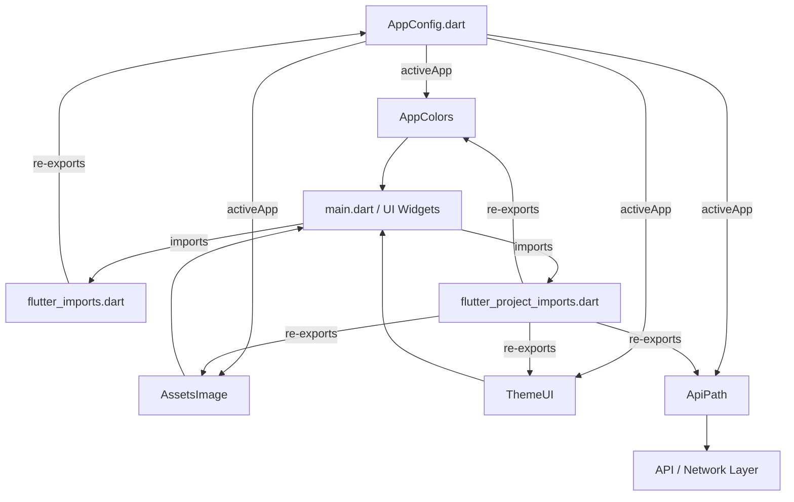

# Design Document: Rider White-Label System

## Overview

The rider white-label system is a compile-time configuration switch that enables producing multiple branded rider apps from a single Flutter codebase. The architecture mirrors the proven pattern from the `sendme` customer app: a central `AppConfig` class with pre-defined brand instances, a single `activeApp` variable that drives all branding, and supporting classes (colors, assets, theme, API paths) that derive their values from `activeApp`.

The key design decision is to use a **compile-time config switch** rather than Flutter build flavors or runtime configuration. This keeps the system simple — a developer changes one line (`activeApp = eatozRider;`) and rebuilds. All downstream classes (colors, assets, theme) automatically reflect the new brand.

This is a newer codebase, so all implementations use modern Dart 3 conventions: non-nullable `final` fields, `const` constructors, modern Color APIs (`withValues()` instead of deprecated `withOpacity()`), and current SDK patterns.

## Architecture



**Data flow**: `activeApp` is the single source of truth. All branding-aware classes read from it at initialization time. Barrel files (`flutter_imports.dart`, `flutter_project_imports.dart`) provide a single import point so every file in the project has access to the full config chain.

**Design rationale**: This pattern was chosen over Flutter build flavors because:

1. Zero build system complexity — no flavor-specific gradle/xcode configs needed
2. Proven in production in the sendme customer app
3. Simple mental model — one variable controls everything
4. All brand configs are visible in one file for easy comparison

## Components and Interfaces

### 1. AppConfig (`lib/AppConfig.dart`)

The central configuration class. Each brand is a `const` instance.

```dart
class AppConfig {
  final String id;
  final String name;
  final Color color;
  final String packageName;
  final String packagePassword;
  final String domainName;
  final String termsAndConditionsLink;
  final String privacyPolicyLink;
  final String whatsappLink;
  final int appType;
  final String androidAppLink;
  final String iosAppLink;
  final String deepLink;
  final String email;
  final String androidBundle;
  final String iosBundle;
  final String iosAppStoreId;
  final String urlLink;

  const AppConfig({
    required this.id,
    required this.name,
    required this.color,
    required this.packageName,
    required this.packagePassword,
    required this.domainName,
    required this.termsAndConditionsLink,
    required this.privacyPolicyLink,
    required this.whatsappLink,
    required this.appType,
    required this.androidAppLink,
    required this.iosAppLink,
    required this.deepLink,
    required this.email,
    required this.androidBundle,
    required this.iosBundle,
    required this.iosAppStoreId,
    required this.urlLink,
  });
}
```

Top-level brand switching:

```dart
/// Change this single line to switch brands
AppConfig activeApp = sendmeRider;
// AppConfig activeApp = eatozRider;
// AppConfig activeApp = sendme6Rider;
// ...
```

### 2. AppColors (`lib/src/common/colors.dart`)

Derives all colors from `activeApp.color`. Uses modern `Color.withValues()`.

```dart
class AppColors {
  static Color mainAppColor = activeApp.color;
  static Color secondAppColor = mainAppColor.withValues(alpha: 0.4);
  static Color pickUpDropAppColor = mainAppColor.withValues(alpha: 0.65);

  // Order Status Colors
  static const Color pendingStatusColor = Color(0xffEDA941);
  static const Color doneStatusColor = Color(0xff50B092);

  // Text Colors
  static const Color textColorBold = Color(0xff000000);
  static const Color textColorLight = Color(0xff7F7F7F);
  static const Color textColorLighter = Color(0xffBDBDBD);

  // App Bar Colors
  static const Color appBarColor = Color(0xffFFFFFF);
  static const Color appBarTextColor = Color(0xff000000);

  static MaterialColor appPrimaryColor = getMaterialColor(mainAppColor);

  static MaterialColor getMaterialColor(Color color) => MaterialColor(
        color.toARGB32(),
        {
          50: Color.fromRGBO(color.r.toInt(), color.g.toInt(), color.b.toInt(), .1),
          100: Color.fromRGBO(color.r.toInt(), color.g.toInt(), color.b.toInt(), .2),
          200: Color.fromRGBO(color.r.toInt(), color.g.toInt(), color.b.toInt(), .3),
          300: Color.fromRGBO(color.r.toInt(), color.g.toInt(), color.b.toInt(), .4),
          400: Color.fromRGBO(color.r.toInt(), color.g.toInt(), color.b.toInt(), .5),
          500: Color.fromRGBO(color.r.toInt(), color.g.toInt(), color.b.toInt(), .6),
          600: Color.fromRGBO(color.r.toInt(), color.g.toInt(), color.b.toInt(), .7),
          700: Color.fromRGBO(color.r.toInt(), color.g.toInt(), color.b.toInt(), .8),
          800: Color.fromRGBO(color.r.toInt(), color.g.toInt(), color.b.toInt(), .9),
          900: Color.fromRGBO(color.r.toInt(), color.g.toInt(), color.b.toInt(), 1),
        },
      );
}
```

### 3. AssetsImage (`lib/src/common/assets_path.dart`)

Centralizes all asset paths. Common assets are `const`. Brand-specific dynamic assets resolve via `activeApp.id`.

```dart
class AssetsImage {
  // === Common assets (shared across all brands) ===
  static const String locationPin = 'assets/apps/common/png_images/location.png';
  static const String riderMap = 'assets/apps/common/png_images/rider_map.png';
  // ... more common assets

  // === Brand-specific assets ===
  static const String sendmeRiderLogo = 'assets/apps/sendmeRider/png_images/logo.png';
  static const String eatozRiderLogo = 'assets/apps/eatozRider/png_images/logo.png';
  // ... more per-brand assets

  // === Dynamic resolution based on activeApp ===
  static String get loadingLogo {
    switch (activeApp.id) {
      case 'sendme_rider': return sendmeRiderLogo;
      case 'eatoz_rider': return eatozRiderLogo;
      // ... other brands
      default: return sendmeRiderLogo;
    }
  }
}
```

**Design decision**: Using `switch` expressions instead of nested ternaries (as in the sendme app) for readability and maintainability.

### 4. AssetsFont (`lib/src/common/assets_path.dart`)

Font family constants, co-located with AssetsImage:

```dart
class AssetsFont {
  static const String textBold = 'PoppinsBold';
  static const String textMedium = 'PoppinsMedium';
  static const String textRegular = 'PoppinsRegular';
  static const String textThin = 'PoppinsThin';
}
```

### 5. ThemeUI (`lib/src/controllers/theme_ui.dart`)

Exposes brand-specific values from `activeApp` for UI consumption:

```dart
class ThemeUI {
  static String appPackageName = activeApp.packageName;
  static String appPassword = activeApp.packagePassword;
  static String appDomainName = activeApp.domainName;
  static String appName = activeApp.name;
  static int appType = activeApp.appType;
  static String androidLink = activeApp.androidAppLink;
  static String iosLink = activeApp.iosAppLink;
  static String email = activeApp.email;
  static String privacyPolicyLink = activeApp.privacyPolicyLink;
  static String termsAndConditionsLink = activeApp.termsAndConditionsLink;
  static String whatsappLink = activeApp.whatsappLink;

  static List<String> languageList = ['English', 'Arabic', 'Hindi', 'French'];
}
```

### 6. ApiPath (`lib/src/api/api_path.dart`)

Centralized API endpoints:

```dart
class ApiPath {
  static const String slsServerPath = 'https://sls.sendme.today/';

  // Rider-specific APIs
  static final String saveRiderLocation = '${slsServerPath}saveriderlocation?';
  static final String updateRider = '${slsServerPath}UpdateRider';
  static final String getRatingsAndReviewsForRider = '${slsServerPath}GetRatingsAndReviewsForRider';
  // ... more endpoints

  // Dynamic links from ThemeUI
  static String get termsAndConditions => ThemeUI.termsAndConditionsLink;
  static String get privacyPolicy => ThemeUI.privacyPolicyLink;
}
```

### 7. Barrel Files

**`lib/flutter_imports.dart`** — Re-exports core Dart libraries, Flutter SDK, and third-party packages:

```dart
export 'dart:async';
export 'dart:convert';
export 'dart:io';
export 'dart:math';
export 'package:flutter/material.dart';
export 'package:flutter/services.dart';
export 'package:sendme_rider/AppConfig.dart';
// ... other common packages as needed
```

**`lib/flutter_project_imports.dart`** — Re-exports all project-specific modules:

```dart
export 'package:sendme_rider/src/api/api_path.dart';
export 'package:sendme_rider/src/common/colors.dart';
export 'package:sendme_rider/src/common/assets_path.dart';
export 'package:sendme_rider/src/common/global_constants.dart';
export 'package:sendme_rider/src/controllers/theme_ui.dart';
// ... other project modules
```

### 8. Localization (`lib/src/controllers/localization/`)

A simple JSON-based localization system loading from `assets/i18n/{locale}.json`:

```dart
class AppLocalizations {
  final Locale locale;
  late Map<String, String> _localizedStrings;

  AppLocalizations(this.locale);

  Future<bool> load() async {
    String jsonString = await rootBundle.loadString('assets/i18n/${locale.languageCode}.json');
    Map<String, dynamic> jsonMap = json.decode(jsonString);
    _localizedStrings = jsonMap.map((key, value) => MapEntry(key, value.toString()));
    return true;
  }

  String? translate(String key) => _localizedStrings[key];
}
```

### 9. Folder Structure

```
sendme_rider/
├── lib/
│   ├── AppConfig.dart
│   ├── flutter_imports.dart
│   ├── flutter_project_imports.dart
│   ├── main.dart
│   └── src/
│       ├── api/
│       │   └── api_path.dart
│       ├── common/
│       │   ├── assets_path.dart
│       │   ├── colors.dart
│       │   └── global_constants.dart
│       ├── controllers/
│       │   ├── localization/
│       │   │   └── app_localization.dart
│       │   └── theme_ui.dart
│       ├── models/
│       ├── providers/
│       ├── resources/
│       ├── service/
│       └── ui/
├── assets/
│   ├── apps/
│   │   ├── common/
│   │   │   ├── png_images/
│   │   │   ├── svg_images/
│   │   │   └── gif_images/
│   │   ├── sendmeRider/
│   │   │   ├── png_images/
│   │   │   ├── svg_images/
│   │   │   └── gif_images/
│   │   ├── eatozRider/
│   │   │   ├── png_images/
│   │   │   ├── svg_images/
│   │   │   └── gif_images/
│   │   ├── sendme6Rider/
│   │   ├── hopshopRider/
│   │   ├── tyebRider/
│   │   ├── sendmeLebanonRider/
│   │   ├── sendmeTalabetakRider/
│   │   └── sendmeShrirampurRider/
│   ├── fonts/
│   │   ├── Poppins-Regular.ttf
│   │   ├── Poppins-Medium.ttf
│   │   ├── Poppins-Bold.ttf
│   │   ├── Poppins-Thin.ttf
│   │   ├── DINNextLTArabic-Regular.ttf
│   │   ├── DINNextLTArabic-Medium.ttf
│   │   └── DINNextLTArabic-Bold.ttf
│   └── i18n/
│       ├── en.json
│       ├── ar.json
│       ├── hi.json
│       └── fr.json
```

## Data Models

### AppConfig Data Model

| Field                  | Type   | Description             | Example (SendMe Rider)            |
| ---------------------- | ------ | ----------------------- | --------------------------------- |
| id                     | String | Unique brand identifier | `'sendme_rider'`                  |
| name                   | String | Display name            | `'SendMe Rider'`                  |
| color                  | Color  | Primary brand color     | `Color(0xff29458E)`               |
| packageName            | String | App package name        | `'today.sendme.rider'`            |
| packagePassword        | String | Package auth password   | `'SMWL2024@Rider'`                |
| domainName             | String | Control panel domain    | `'cp-rider.sendme.today'`         |
| termsAndConditionsLink | String | T&C URL                 | `'https://...'`                   |
| privacyPolicyLink      | String | Privacy policy URL      | `'https://...'`                   |
| whatsappLink           | String | WhatsApp support link   | `'https://wa.me/...'`             |
| appType                | int    | App type identifier     | `2`                               |
| androidAppLink         | String | Play Store URL          | `'https://play.google.com/...'`   |
| iosAppLink             | String | App Store URL           | `'https://apps.apple.com/...'`    |
| deepLink               | String | Deep link domain        | `'https://deeplink.sendme.today'` |
| email                  | String | Support email           | `'rider@sendme.today'`            |
| androidBundle          | String | Android bundle ID       | `'today.sendme.rider'`            |
| iosBundle              | String | iOS bundle ID           | `'com.vs2.sendmerider'`           |
| iosAppStoreId          | String | App Store ID            | `'1234567890'`                    |
| urlLink                | String | Web URL                 | `'https://sendme.today?'`         |

### Brand Instances

| Brand                   | id                        | color                 | packageName                    |
| ----------------------- | ------------------------- | --------------------- | ------------------------------ |
| SendMe Rider            | `sendme_rider`            | `0xff29458E` (blue)   | `today.sendme.rider`           |
| Eatoz Rider             | `eatoz_rider`             | `0xff1982C4` (blue)   | `today.eatoz.rider`            |
| SendMe6 Rider           | `sendme6_rider`           | `0xff1982C4` (blue)   | `today.sendme6.rider`          |
| Hopshop Rider           | `hopshop_rider`           | `0xffF97C38` (orange) | `today.hopshop.rider`          |
| Tyeb Rider              | `tyeb_rider`              | `0xff000000` (black)  | `today.tyeb.rider`             |
| SendMe Lebanon Rider    | `sendme_lebanon_rider`    | `0xff1982C4` (blue)   | `today.sendmelebanon.rider`    |
| SendMe Talabetak Rider  | `sendme_talabetak_rider`  | `0xfff74747` (red)    | `today.talabetak.rider`        |
| SendMe Shrirampur Rider | `sendme_shrirampur_rider` | `0xff29458E` (blue)   | `today.sendmeshrirampur.rider` |

## Correctness Properties

_A property is a characteristic or behavior that should hold true across all valid executions of a system — essentially, a formal statement about what the system should do. Properties serve as the bridge between human-readable specifications and machine-verifiable correctness guarantees._

### Property 1: Brand instance completeness and naming convention

_For any_ brand instance defined in AppConfig.dart, all fields (id, name, packageName, packagePassword, domainName, termsAndConditionsLink, privacyPolicyLink, whatsappLink, androidAppLink, iosAppLink, deepLink, email, androidBundle, iosBundle, iosAppStoreId, urlLink) SHALL be non-empty strings, the color SHALL be non-null, and the packageName SHALL contain the substring `.rider` or match the pattern `today.{brand}.rider`.

**Validates: Requirements 1.3, 1.5**

### Property 2: getMaterialColor produces valid MaterialColor

_For any_ Color input, `AppColors.getMaterialColor(color)` SHALL return a `MaterialColor` containing exactly the shade keys [50, 100, 200, 300, 400, 500, 600, 700, 800, 900], and each shade SHALL be a non-null Color.

**Validates: Requirements 2.3**

### Property 3: Asset path prefix consistency

_For any_ static common asset path in AssetsImage, the path SHALL start with `'assets/apps/common/'`. _For any_ static brand-specific asset path in AssetsImage, the path SHALL start with `'assets/apps/'` followed by a known brand folder name.

**Validates: Requirements 3.1, 3.2**

### Property 4: Dynamic asset resolution matches active brand

_For any_ brand instance set as `activeApp`, the dynamic asset getters (loadingLogo, loader, defaultItem, defaultOutlet, loadingSVGLogo) SHALL return a path that contains the corresponding brand's asset folder name, or the SendMe Rider folder name as fallback for unknown brands.

**Validates: Requirements 3.3, 3.4**

### Property 5: ThemeUI fields mirror activeApp

_For any_ brand instance set as `activeApp`, the ThemeUI static fields (appPackageName, appPassword, appDomainName, appName, appType, androidLink, iosLink, email, privacyPolicyLink, termsAndConditionsLink, whatsappLink) SHALL equal the corresponding fields on `activeApp`.

**Validates: Requirements 5.1**

### Property 6: API endpoints use server path prefix

_For any_ endpoint string defined in ApiPath (excluding dynamic getters), the value SHALL start with `ApiPath.slsServerPath`.

**Validates: Requirements 8.2**

### Property 7: Localization round-trip

_For any_ key-value pair in a translation JSON file, loading the file via AppLocalizations and calling `translate(key)` SHALL return the original value string.

**Validates: Requirements 9.3**

## Error Handling

| Scenario                                        | Handling Strategy                                                                     |
| ----------------------------------------------- | ------------------------------------------------------------------------------------- |
| Unknown `activeApp.id` in dynamic asset getters | Return SendMe Rider asset as default fallback (Req 3.4)                               |
| Missing translation key                         | `translate()` returns `null`, caller displays key or fallback                         |
| Missing asset file at runtime                   | Flutter's default asset error handling; placeholder assets in common folder           |
| Invalid Color passed to `getMaterialColor`      | No special handling needed — Color is a value type, always valid                      |
| Empty string fields in AppConfig                | Prevented by `required` non-nullable fields in const constructor — compile-time error |

The system is designed to fail at compile time rather than runtime wherever possible. Using `required` non-nullable `final` fields in `AppConfig` means a brand instance with missing data won't compile. The only runtime fallback needed is for dynamic asset resolution when an unknown brand id is encountered.

## Testing Strategy

### Testing Framework

- **Unit tests**: `flutter_test` (built-in)
- **Property-based tests**: `glados` package (Dart property-based testing library)
- Minimum 100 iterations per property test

### Unit Tests

Unit tests cover specific examples and edge cases:

- Verify each brand instance has expected id, name, and color values
- Verify AppColors static constants have expected hex values
- Verify AssetsFont constants match expected font family names
- Verify ThemeUI.languageList contains exactly 4 languages
- Verify ApiPath.slsServerPath is the expected URL
- Verify fallback behavior when unknown brand id is used in asset getters

### Property-Based Tests

Each correctness property maps to a single property-based test:

- **Feature: rider-white-label, Property 1: Brand instance completeness and naming** — Generate/iterate over all brand instances, verify all fields non-empty and packageName pattern
- **Feature: rider-white-label, Property 2: getMaterialColor produces valid MaterialColor** — Generate random Colors, verify 10 shade keys present
- **Feature: rider-white-label, Property 3: Asset path prefix consistency** — Iterate over all asset path constants, verify prefix rules
- **Feature: rider-white-label, Property 4: Dynamic asset resolution matches active brand** — Iterate over all brand instances, set as active, verify dynamic getter paths
- **Feature: rider-white-label, Property 5: ThemeUI fields mirror activeApp** — Iterate over all brand instances, verify ThemeUI delegation
- **Feature: rider-white-label, Property 6: API endpoints use server path prefix** — Iterate over all endpoint strings, verify prefix
- **Feature: rider-white-label, Property 7: Localization round-trip** — Load translation files, verify all keys round-trip correctly

### Test Organization

Tests live under `test/` mirroring the source structure:

```
test/
├── app_config_test.dart
├── common/
│   ├── colors_test.dart
│   └── assets_path_test.dart
├── controllers/
│   └── theme_ui_test.dart
├── api/
│   └── api_path_test.dart
└── localization/
    └── app_localization_test.dart
```
